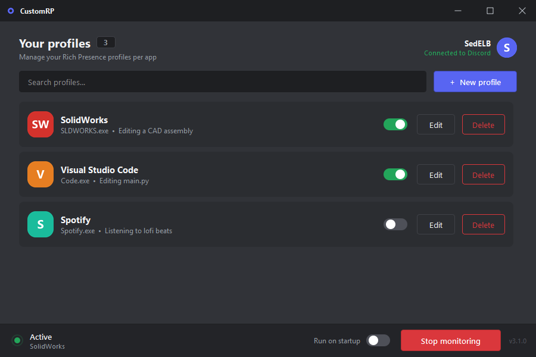
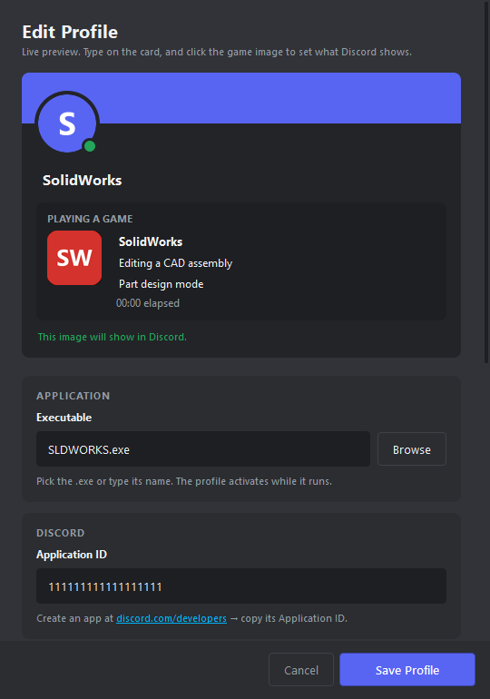
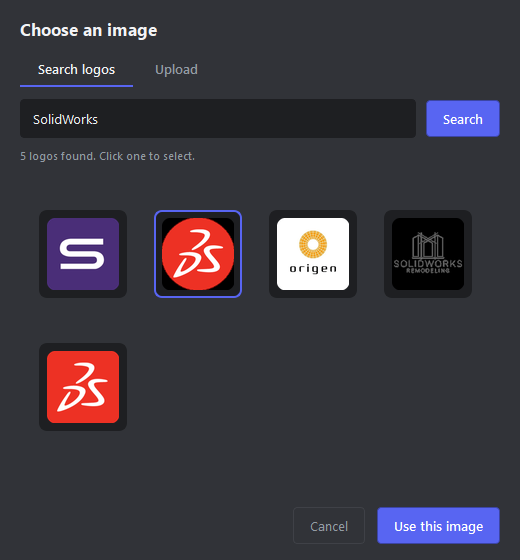

# CustomRP

CustomRP is a Windows system tray application that manages your Discord Rich Presence on a per application basis. It runs quietly in the background, detects when an application you have profiled is running, and updates your Discord status to match. When the application closes, the status clears.



## Features

- Per application profiles. Each profile maps an executable to a custom Discord status.
- Live editor with a Discord style preview card that updates as you type.
- Logo search (free, no API key required) and local image upload. Both are hosted automatically so they actually appear in Discord.
- Automatic detection. While CustomRP is running, launching a profiled app shows the status within about two seconds.
- Run on startup option, so CustomRP is always ready in the tray.
- System tray icon with idle, active, and error states.

## Requirements

- Windows 10 or 11
- The Discord desktop application, running
- Python 3.11 or newer (only needed if you run from source)

## Setup

### 1. Install Python

If you do not already have it, download Python 3.11 or newer from https://www.python.org/downloads/ and install it. On the first installer screen, tick "Add Python to PATH".

Verify the install by opening a terminal (PowerShell) and running:

```
py --version
```

### 2. Get the code

Download this repository (use the green Code button, then Download ZIP) and extract it, or clone it with git:

```
git clone <repository-url>
```

### 3. Install the dependencies

Open a terminal in the project folder and run:

```
py -m pip install -r requirements.txt
```

This installs PyQt6, pypresence, psutil, Pillow, and requests.

### 4. Run it

```
py main.py
```

The main window opens and an icon is added to your system tray. Closing the window hides it to the tray. To quit completely, right click the tray icon and choose Quit.

## Get a Discord Application ID

Every profile needs a Discord Application ID so Discord knows which application the presence belongs to.

1. Go to https://discord.com/developers/applications and sign in.
2. Click New Application. Give it a name. This name becomes the bold title shown in your status. Click Create.
3. Open General Information and copy the Application ID.

You will paste this ID into the profile editor in the next step. You do not need to upload anything in the developer portal, CustomRP handles images for you.

## Create a profile

Click New Profile to open the editor.



The card at the top is a live preview of exactly what Discord will show. You edit it directly:

- Application name: the bold line. Type it on the card.
- Details and state: the two lines underneath.

Then fill in the rest of the form:

- Executable: click Browse and select the program's .exe (for example SLDWORKS.exe), or type the name. The profile becomes active whenever that process is running.
- Application ID: paste the Discord Application ID from the previous section.
- Behavior: switch Show elapsed time and Enable profile on or off.

Click Save Profile. The new profile appears in the list.

## Set the presence image

Click the game image on the preview card to open the image chooser.



There are two ways to set an image:

- Search logos: type a brand or app name, press Search, then click a result. Logos come from a free source and need no API key.
- Upload: choose a local PNG, JPG, ICO, or WEBP file.

Either way, CustomRP hosts the image for you and fills in the image URL automatically, so it renders in Discord. Please note that the image is uploaded to a public image host so that Discord can read it.

Two things worth knowing:

- Discord cannot display a local file on its own, which is why CustomRP hosts it. A local path alone will not appear in Discord.
- The round avatar at the top of the card is a generic Discord avatar. It does not change. Only the game image is editable, because Rich Presence cannot change your real Discord profile picture.

## Start monitoring

Click Start monitoring in the bottom left of the sidebar. The status indicator changes to Active when a profiled application is detected. Launch one of your profiled applications and your Discord status updates within about two seconds.

When you are finished, click Stop monitoring, or quit from the tray icon.

## Run on startup

Turn on Run on startup in the sidebar. CustomRP will then launch into the tray automatically when Windows starts, with monitoring already running. After that, simply launching any profiled application shows the status, with nothing else to click.

To turn this off, switch Run on startup back off.

## How it works

- main.py starts the tray icon, the window, and the process monitor.
- The monitor checks running processes every two seconds using psutil and activates the matching profile.
- rpc_manager talks to Discord over its local connection using pypresence and updates the presence.
- Elapsed time counts from the moment the presence becomes active, not from when the application first launched.

## Troubleshooting

- The status does not appear. Make sure the Discord desktop app is open and that you clicked Start monitoring. The tray icon turns red and reads "Discord not detected" when Discord is not found.
- The image does not show in Discord. Set the image through the chooser, which hosts it, or paste a public image URL into the large image field. A local file by itself will not appear.
- The wrong app is detected, or none is. The target must match the process name exactly, for example SLDWORKS.exe. Using Browse avoids typos.

## Optional: build a single executable

To package CustomRP as one .exe, use PyInstaller and include the PyQt6 files:

```
py -m pip install pyinstaller
py -m PyInstaller --noconsole --onefile --collect-all PyQt6 main.py
```

If you turned on Run on startup before packaging, switch it off and on once after building, so the startup entry points at the new executable.
